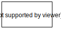
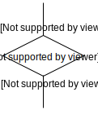

# Notation

An *entity* is represented with a box

An *relation* is represented with a diamond, the *cardinality* of the relation is written on the line that links the relation with the entity

An *attribute* is represented with a line with a circle at th end

An attribute that is *key* for the entity is represented with a line and a full dot at the end

An *composite key* is repsented with a line with a dot that runs through the attributes that make the composite key

