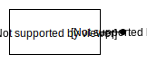
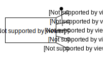
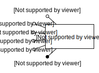

# Usage

All keywords are **case insensitive**.

### Entity

To draw an entity type *entity* (or just *e*) followeed by his name and a pair of parenthesis, like so `entity Employee()`

To add a key attribute type the attribute name folowed by *pk* inside the parenthesis like so `entity Employee(id pk)`

To add attributes type the attribute name inside the parenthesis, multiple attributes must be comma separated like so `entity Employee(id pk, firstName, lastName)`

To add a composite key type all the attributes of the composite key followed by *pk* like so `entity Employee(firstName pk, lastName pk, email, hireDate, salary)`

To change the position the attributes are displayed add a string after the closing parenthesis, the string can be one or two characters long, the allowed characters are: *N, E, S, W* (*N* will be up, *E* right, *S* down, *W* left). Combining two of them, like *NE* will position the attributes on the top-right of the entity, *NS* will put half of the attributes on top, half below. Doing `entity Employee(id pk, firstName, lastName, email, hireDate, salary)w` will result in

### Relation

To draw a relation type *relation* (or just *r*) followeed by his name and a pair of parenthesis, like so `relation WorksFor()`

By default the relation will have *cardinality one-to-many* directed up and *one-to-one* directed down. To change this this add a string after the closing parenthesis, the string must be formatted like so: *dir1 card1, dir2 card2* where *dir* is one of *N, E, S, W* (*N* will be up, *E* right, *S* down, *W* left) and *card* is one of *1N, 11, N1, 01, 10, 0N, N0, MN, NM* (*1N* will be one-to-many, *11 one-to-one*, *01* zero-to-one, *MN* many-to-many, ... ). An exemple is `relation WorksFor()e 11, w 1N`

To add attributes to the relation type the attribute name inside the parenthesis (multiple attributes must be comma separated), like so `relation WorksFor(hireDate)e 11, w 1N`

